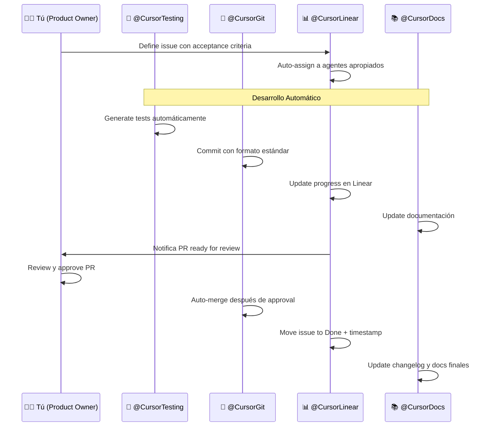

# 🤖 Configuración de Automatización MIC MAC Pro

## Agentes Especializados Configurados

### 🧪 @CursorTesting - Testing Automático
**Issue ID**: API-8  
**Responsabilidades**:
- Generar unit tests automáticamente para cada componente
- Mantener coverage >80% en todo momento
- Ejecutar regression tests automáticamente
- Actualizar métricas de testing en Linear
- Crear issues de testing para nuevas features

**Triggers**:
```javascript
// Auto-triggers para @CursorTesting
- Nuevo componente creado → Generar tests automáticamente
- Coverage <80% → Crear tests adicionales
- PR creado → Ejecutar full test suite
- Deploy → Ejecutar smoke tests
```

**Linear Integration**:
- Auto-update progress en API-8
- Auto-create testing sub-issues
- Auto-comment coverage reports
- Auto-assign testing issues

---

### 📝 @CursorGit - Git & Commits Automáticos  
**Issue ID**: API-9  
**Responsabilidades**:
- Commits automáticos con mensajes consistentes
- Branch management automático
- PR creation con templates
- Merge conflict resolution
- Changelog automation
- Mi nombre es "Carlos Diaz"
- Correo en github "diazpolanco13@gmail.com"

**Commit Format Automático**:
```bash
# Formato estándar automático:
feat(auth): implement login component (Linear: API-X)
fix(voting): resolve mobile touch issues (Linear: API-Y)  
test(crud): add unit tests for projects (Linear: API-Z)
docs(readme): update installation guide (Linear: API-W)
```

**Branch Naming Automático**:
```bash
# Formato: usuario/issue-id-descripcion-corta
diazpolanco13/api-5-setup-nextjs-supabase-prisma
diazpolanco13/api-11-auth-login-component
diazpolanco13/api-12-voting-matrix-mobile
```

**Linear Integration**:
- Auto-comment commit links en issues
- Auto-update issue status basado en commits
- Auto-move to "In Review" cuando PR creado
- Auto-close issue cuando PR merged

---

### 📊 @CursorLinear - Sincronización Automática
**Issue ID**: API-10  
**Responsabilidades**:
- Update automático de progreso de issues
- State transitions automáticas
- Progress tracking en tiempo real
- Milestone notifications
- Performance metrics

**Auto-Monitoring Rules**:
```typescript
// Reglas de monitoreo automático:
const autoRules = {
  onCommit: () => updateIssueProgress(),
  onTestsPass: () => moveToReadyForReview(),
  onPRMerged: () => moveToCompleted(),
  onCoverage80: () => createNextPhaseIssue(),
  onBugDetected: () => createBugIssue(),
  onDeploySuccess: () => notifyStakeholders()
}
```

**Dashboard Automation**:
- Real-time progress charts
- Velocity calculations
- Burndown charts auto-generated
- Risk assessment alerts
- Team performance metrics

---

### 📚 @CursorDocs - Documentación Automática
**Issue ID**: API-11 (a crear)  
**Responsabilidades**:
- README automático en español
- API documentation generation
- Code comments consistency
- Architecture diagrams updates
- User manuals maintenance

**Auto-Documentation Rules**:
```typescript
// Documentación automática:
- Nueva API → Auto-generate API docs
- Nuevo componente → Auto-update component docs  
- Schema change → Auto-update database docs
- Deploy → Auto-update changelog
- Feature complete → Auto-update user manual
```

---

## 🔄 Workflow Automatizado Completo

### Flujo de Desarrollo Típico:


### Estados Automáticos en Linear:
```
Backlog → In Progress (auto al asignar agente)
In Progress → Testing (auto cuando código completo)  
Testing → Ready for Review (auto cuando tests >80%)
Ready for Review → In Review (auto cuando PR creado)
In Review → Done (auto cuando PR merged)
Done → Deployed (auto cuando deploy exitoso)
```

## 🚀 Configuración GitHub Actions

### Archivo: `.github/workflows/automation.yml`
```yaml
name: MIC MAC Pro Automation

on:
  push:
    branches: [ main, develop ]
  pull_request:
    branches: [ main ]

jobs:
  testing-automation:
    runs-on: ubuntu-latest
    steps:
      - uses: actions/checkout@v3
      - name: Setup Node.js
        uses: actions/setup-node@v3
        with:
          node-version: '18'
      
      - name: Install dependencies
        run: npm ci
      
      - name: Run tests with coverage
        run: npm run test:coverage
      
      - name: Update Linear Testing Issue
        uses: ./actions/update-linear-testing
        with:
          issue-id: 'API-8'
          coverage: ${{ steps.coverage.outputs.percentage }}
  
  git-automation:
    runs-on: ubuntu-latest  
    steps:
      - name: Auto-format commits
        uses: ./actions/format-commits
        with:
          linear-project: 'MIC MAC Pro'
      
      - name: Update Linear Git Issue
        uses: ./actions/update-linear-git
        with:
          issue-id: 'API-9'
          
  linear-automation:
    runs-on: ubuntu-latest
    steps:
      - name: Sync Linear Progress
        uses: ./actions/sync-linear-progress
        with:
          issue-id: 'API-10'
          project-id: 'cf02bb0f-a49d-4f9c-9a85-bd4d03e5aed4'
```

## 🔔 Configuración de Notificaciones

### Webhooks Linear → Slack
```javascript
// Configuración webhook automático
const linearWebhook = {
  url: process.env.SLACK_WEBHOOK_URL,
  events: [
    'issue.created',
    'issue.updated', 
    'issue.completed',
    'project.milestone'
  ],
  formatters: {
    'issue.completed': (data) => ({
      text: `🎉 Issue completado: ${data.title}`,
      channel: '#micmac-progress'
    }),
    'project.milestone': (data) => ({
      text: `🚀 Milestone alcanzado: ${data.milestone}`,  
      channel: '#micmac-milestones'
    })
  }
}
```

## 📊 Métricas Automáticas

### Dashboard Tiempo Real:
```typescript
// Métricas que se actualizan automáticamente:
interface AutoMetrics {
  velocity: number;           // Issues/día promedio
  testCoverage: number;       // % coverage actual  
  bugRate: number;           // Bugs/feature ratio
  deployFrequency: number;   // Deploys/semana
  leadTime: number;          // Tiempo issue → deploy
  mttr: number;              // Mean time to recovery
}
```

## ✅ Checklist de Configuración

### Fase 1: Setup Básico
- [ ] Crear issues de agentes especializados ✅
- [ ] Configurar GitHub repository
- [ ] Setup GitHub Actions workflows
- [ ] Configurar webhooks Linear-GitHub

### Fase 2: Integración Avanzada  
- [ ] Configurar Slack notifications
- [ ] Setup dashboard métricas automáticas
- [ ] Configurar auto-assignment rules
- [ ] Testing de flujo completo

### Fase 3: Optimización
- [ ] Fine-tuning de triggers automáticos
- [ ] Configurar alertas proactivas
- [ ] Setup reporting automático
- [ ] Documentar troubleshooting

## 🎯 Resultado Final

Con esta configuración tendrás:

✅ **Zero Manual Work**: Agentes manejan testing, commits, tracking, docs  
✅ **100% Linear Sync**: Progreso siempre actualizado automáticamente  
✅ **Quality Assured**: Testing >80% automático + regression tests  
✅ **Consistent Git**: Commits y PRs con formato estándar  
✅ **Real-time Visibility**: Dashboard con métricas en vivo  
✅ **Proactive Alerts**: Notificaciones de blockers y milestones  

**Tu rol se convierte en**: Product Owner estratégico que define requirements y toma decisiones, mientras los agentes ejecutan la implementación automáticamente.

---

*Configuración creada: 2025-08-23*  
*Proyecto: MIC MAC Pro MVP*  
*Estado: Ready for Implementation* 🚀
